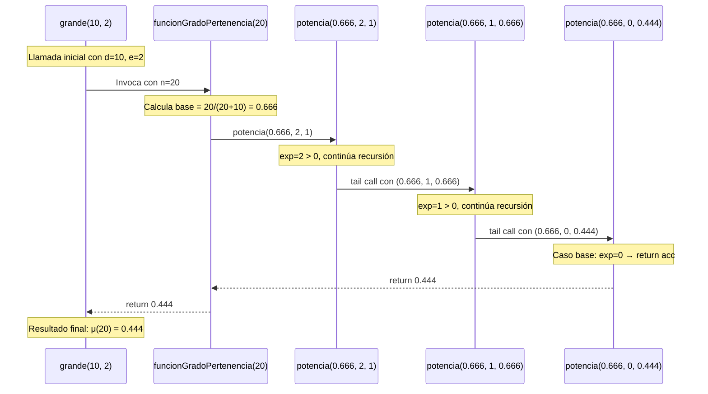
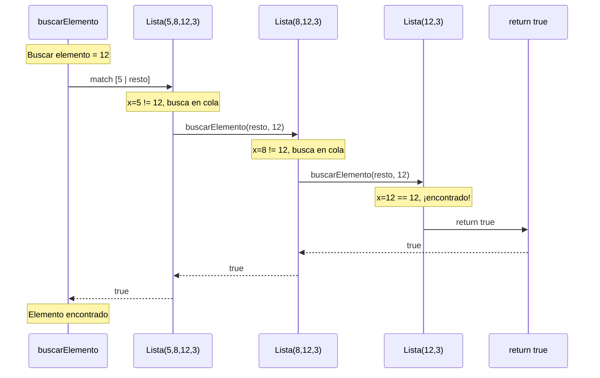
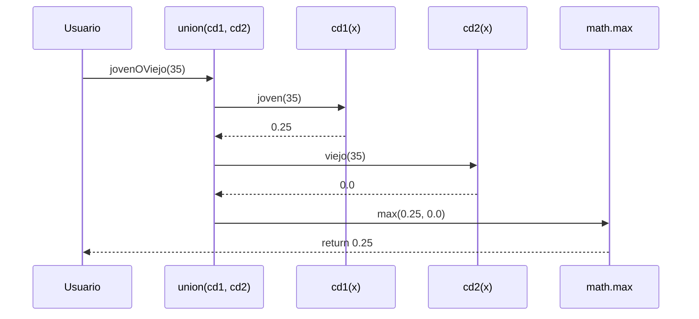
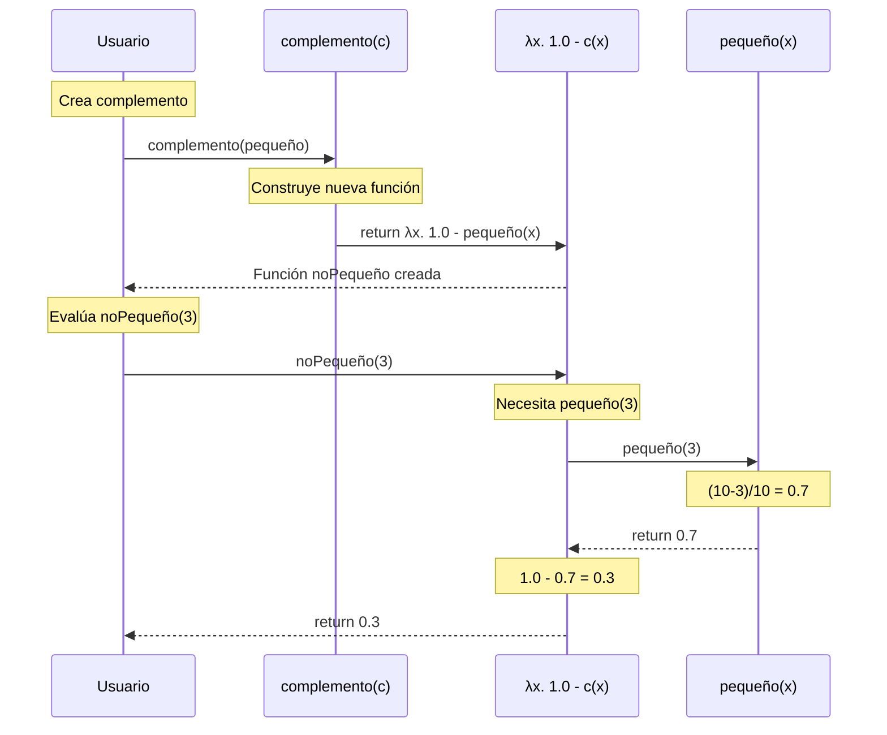
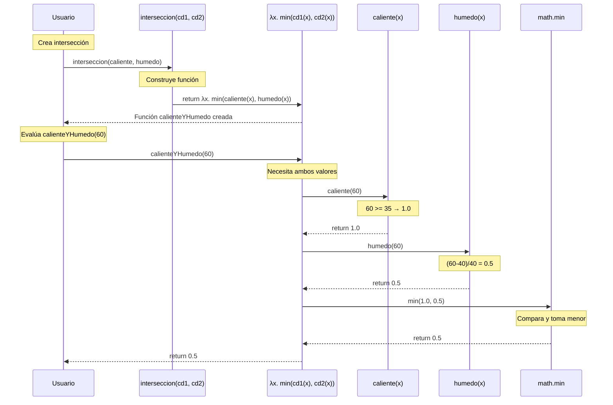
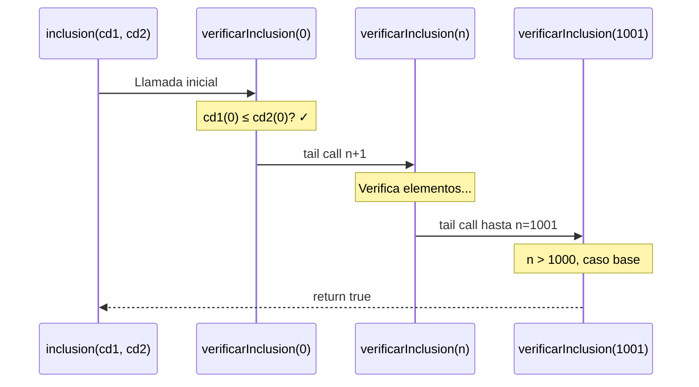

# Informe de Programación Funcional: Operaciones con Conjuntos Difusos

## Tabla de Contenidos
1. [BigNumber - Función de Pertenencia Grande](#bignumber)
2. [BuscarLista - Búsqueda en Listas](#buscarlista)
3. [ConjDifusoOps - Operaciones Básicas](#conjdifusoops)
4. [InclusionIgualdad - Relaciones entre Conjuntos](#inclusionigualdad)

---

# BigNumber - Función de Pertenencia "Grande"

## Introducción

El algoritmo `BigNumber` implementa una función de pertenencia difusa que modela el concepto lingüístico de "número grande". Utiliza una función sigmoidal parametrizada que permite ajustar tanto el umbral de transición como la suavidad de la curva. Este tipo de función es fundamental en sistemas de lógica difusa para representar conceptos cualitativos mediante valores numéricos graduales.

## Definición del Algoritmo BigNumber

```scala
class BigNumber {
  type ConjDifuso = Int => Double
  
  def grande(d: Int, e: Int): ConjDifuso = {
    @tailrec
    def potencia(b: Double, exp: Int, acc: Double): Double = {
      if (exp == 0) acc
      else {
        potencia(b, exp - 1, acc * b)
      }
    }

    def funcionGradoPertenencia(n: Int): Double = {
      if (n <= 0) {
        0.0
      } else {
        val base = n.toDouble / (n + d)
        potencia(base, e, 1)
      }
    }
    funcionGradoPertenencia
  }
}
```

## Componentes del Algoritmo

### Tipo ConjDifuso
```scala
type ConjDifuso = Int => Double
```
Alias de tipo que representa un conjunto difuso como una función característica que mapea enteros a grados de pertenencia (valores entre 0.0 y 1.0).

### Parámetros de la función `grande`
- **d (Int)**: Parámetro de desplazamiento que controla el punto medio de la transición. Valores mayores desplazan la curva hacia la derecha.
- **e (Int)**: Exponente que controla la pendiente/suavidad de la transición. Valores mayores crean transiciones más abruptas.

### Función auxiliar `potencia`
Implementa la exponenciación mediante recursión de cola:
- **b (Double)**: Base de la potencia
- **exp (Int)**: Exponente (número de multiplicaciones)
- **acc (Double)**: Acumulador que va construyendo el resultado

### Función `funcionGradoPertenencia`
Calcula el grado de pertenencia para un elemento específico usando la fórmula matemática del conjunto difuso "grande".

## Explicación Paso a Paso

### Caso Base - Números No Positivos
```scala
if (n <= 0) {
  0.0
}
```
Los números menores o iguales a cero tienen grado de pertenencia 0.0, ya que definitivamente no son "grandes".

### Caso Recursivo - Cálculo del Grado
```scala
val base = n.toDouble / (n + d)
potencia(base, e, 1)
```

1. **Normalización**: Calcula la base usando la fórmula `n/(n+d)`, que produce valores entre 0 y 1
2. **Elevación a potencia**: Aplica el exponente `e` usando recursión de cola
3. **Retorno**: Devuelve el grado de pertenencia calculado

### Función Auxiliar de Potencia

#### Caso Base
```scala
if (exp == 0) acc
```
Cuando el exponente llega a 0, retorna el acumulador que contiene el resultado.

#### Caso Recursivo
```scala
potencia(b, exp - 1, acc * b)
```
Decrementa el exponente y multiplica el acumulador por la base en cada iteración.

## Principio Matemático

La función de pertenencia "grande" se define como:

$$
\mu_{\text{grande}}(n; d, e) = \begin{cases}
0 & \text{si } n \leq 0 \\
\left(\frac{n}{n + d}\right)^e & \text{si } n > 0
\end{cases}
$$

### Propiedades de la función:
1. **Límites**: $\lim_{n \to 0^+} \mu(n) = 0$ y $\lim_{n \to \infty} \mu(n) = 1$
2. **Monotonía**: La función es estrictamente creciente para $n > 0$
3. **Punto de inflexión**: Aproximadamente en $n = d$, donde $\mu(d) = (1/2)^e$

### Función de Potencia
$$
\text{potencia}(b, e, \text{acc}) = \begin{cases}
\text{acc} & \text{si } e = 0 \\
\text{potencia}(b, e-1, \text{acc} \times b) & \text{si } e > 0
\end{cases}
$$

## Llamados de Pila - Ejemplo: grande(10, 2)

### Configuración
```scala
val conjGrande = grande(10, 2)
val grado = conjGrande(20)
```

### Paso 1: Cálculo de la base
```scala
n = 20, d = 10
base = 20.0 / (20 + 10) = 20.0 / 30.0 = 0.6666...
```

### Paso 2: Llamada a potencia
```scala
potencia(0.6666, 2, 1)
```

### Paso 3: Primera iteración de potencia
```scala
exp = 2, acc = 1
potencia(0.6666, 1, 1 * 0.6666) = potencia(0.6666, 1, 0.6666)
```

### Paso 4: Segunda iteración de potencia
```scala
exp = 1, acc = 0.6666
potencia(0.6666, 0, 0.6666 * 0.6666) = potencia(0.6666, 0, 0.4444)
```

### Paso 5: Caso base de potencia
```scala
exp = 0, return 0.4444
```

### Paso 6: Resultado final
```scala
conjGrande(20) = 0.4444 ✓
```

---

## Comparación de Valores con Diferentes Parámetros

### Tabla 1: Efecto del parámetro d (con e=2)

| n | grande(5, 2) | grande(10, 2) | grande(20, 2) |
|---|--------------|---------------|---------------|
| 5 | 0.25 | 0.11 | 0.06 |
| 10 | 0.44 | 0.25 | 0.11 |
| 20 | 0.64 | 0.44 | 0.25 |
| 50 | 0.83 | 0.69 | 0.51 |
| 100 | 0.91 | 0.83 | 0.69 |

### Tabla 2: Efecto del parámetro e (con d=10)

| n | grande(10, 1) | grande(10, 2) | grande(10, 3) |
|---|---------------|---------------|---------------|
| 5 | 0.33 | 0.11 | 0.04 |
| 10 | 0.50 | 0.25 | 0.13 |
| 20 | 0.67 | 0.44 | 0.30 |
| 50 | 0.83 | 0.69 | 0.58 |
| 100 | 0.91 | 0.83 | 0.75 |

---

## Ejemplos de Uso

```scala
val bn = new BigNumber()

// Conjunto "grande" con transición suave (d=10, e=1)
val grandeModeradamente = bn.grande(10, 1)
println(grandeModeradamente(5))   // 0.333...
println(grandeModeradamente(10))  // 0.5
println(grandeModeradamente(20))  // 0.666...

// Conjunto "grande" con transición abrupta (d=10, e=3)
val grandeDefinitivamente = bn.grande(10, 3)
println(grandeDefinitivamente(5))   // 0.037
println(grandeDefinitivamente(10))  // 0.125
println(grandeDefinitivamente(20))  // 0.296

// Conjunto "grande" con umbral alto (d=50, e=2)
val muyGrande = bn.grande(50, 2)
println(muyGrande(20))   // 0.129
println(muyGrande(50))   // 0.25
println(muyGrande(100))  // 0.444
```

## Diagrama de Llamados de Pila



## Notación Matemática del BigNumber

### Definición Formal

$$
\text{grande}(d, e) = \mu_{\text{grande}}(\cdot; d, e)
$$

donde:

$$
\mu_{\text{grande}}(n; d, e) = \begin{cases}
0 & \text{si } n \leq 0 \\
\left(\frac{n}{n + d}\right)^e & \text{si } n > 0
\end{cases}
$$

### Función Auxiliar de Potencia

$$
\text{potencia}(b, e, \text{acc}) = \begin{cases}
\text{acc} & \text{si } e = 0 \\
\text{potencia}(b, e-1, \text{acc} \cdot b) & \text{si } e > 0
\end{cases}
$$

### Invariante de la Función Potencia
$$
\forall \text{ llamada: } \text{acc}_{actual} \times b^{e_{actual}} = b^{e_{inicial}}
$$

### Propiedades Matemáticas

1. **Dominio y Rango**:
    - Dominio: $\mathbb{Z}$
    - Rango: $[0, 1]$

2. **Límites**:
    - $\lim_{n \to 0^+} \mu(n; d, e) = 0$
    - $\lim_{n \to \infty} \mu(n; d, e) = 1$

3. **Derivada** (para valores continuos):
   $$
   \frac{d\mu}{dn} = \frac{e \cdot d}{(n+d)^2} \cdot \left(\frac{n}{n+d}\right)^{e-1} > 0 \text{ para } n > 0
   $$

### Complejidad
- **Temporal función grande**: $O(1)$ - construcción de la función
- **Temporal funcionGradoPertenencia**: $O(e)$ - llamadas a potencia
- **Temporal potencia**: $O(e)$ - recursión de cola
- **Espacial**: $O(1)$ - recursión de cola optimizada

---

## Conclusión

El algoritmo `BigNumber` demuestra cómo implementar funciones de pertenencia parametrizables en lógica difusa utilizando programación funcional. La combinación de recursión de cola para el cálculo de potencias y funciones de orden superior para construir conjuntos difusos muestra la elegancia y expresividad de Scala. Este enfoque es fundamental para modelar conceptos lingüísticos vagos como "grande", "pequeño", "rápido", etc., que son esenciales en sistemas de control difuso y toma de decisiones.

---

# BuscarLista - Búsqueda en Listas

## Introducción

El algoritmo `BuscarLista` implementa una búsqueda lineal en listas utilizando pattern matching y recursión estructural sobre listas. Este enfoque funcional demuestra cómo procesar estructuras de datos recursivas de manera natural y elegante, sin necesidad de bucles imperativos o índices.

## Definición del Algoritmo BuscarLista

```scala
class BuscarLista() {
  def buscarElemento(lista: List[Int], elemento: Int): Boolean = {
    lista match {
      case Nil => false
      case x :: xs => if (x == elemento) true else buscarElemento(xs, elemento)
    }
  }
}
```

## Componentes del Algoritmo

### Parámetros de `buscarElemento`
- **lista (List[Int])**: Lista de enteros donde se realizará la búsqueda
- **elemento (Int)**: Valor que se desea encontrar en la lista

### Valor de Retorno
- **Boolean**: `true` si el elemento existe en la lista, `false` en caso contrario

## Explicación Paso a Paso

### Caso Base - Lista Vacía
```scala
case Nil => false
```
Cuando la lista está vacía (`Nil`), el elemento no puede existir en ella, por lo que retorna `false`.

### Caso Recursivo - Lista No Vacía
```scala
case x :: xs => if (x == elemento) true else buscarElemento(xs, elemento)
```

El pattern matching descompone la lista en:
- **x**: Cabeza de la lista (primer elemento)
- **xs**: Cola de la lista (resto de elementos)

**Lógica de búsqueda**:
1. Compara el primer elemento (`x`) con el elemento buscado
2. Si coinciden, retorna `true` inmediatamente
3. Si no coinciden, continúa la búsqueda recursivamente en la cola (`xs`)

## Principio Matemático

La búsqueda se puede expresar formalmente como:

$$
\text{buscarElemento}(L, e) = \begin{cases}
\text{false} & \text{si } L = [] \\
\text{true} & \text{si } L = [x | xs] \land x = e \\
\text{buscarElemento}(xs, e) & \text{si } L = [x | xs] \land x \neq e
\end{cases}
$$

### Propiedades
1. **Correctitud**: El algoritmo siempre termina (lista finita)
2. **Búsqueda temprana**: Se detiene al encontrar la primera ocurrencia
3. **Recorrido completo**: En el peor caso, examina todos los elementos

## Llamados de Pila - Ejemplo: buscarElemento(List(5, 8, 12, 3), 12)

### Configuración Inicial
```scala
lista = List(5, 8, 12, 3)
elemento = 12
```

### Paso 1: Primera llamada
```scala
buscarElemento(List(5, 8, 12, 3), 12)
// x = 5, xs = List(8, 12, 3)
// 5 != 12, continúa recursión
```

### Paso 2: Segunda llamada
```scala
buscarElemento(List(8, 12, 3), 12)
// x = 8, xs = List(12, 3)
// 8 != 12, continúa recursión
```

### Paso 3: Tercera llamada
```scala
buscarElemento(List(12, 3), 12)
// x = 12, xs = List(3)
// 12 == 12, retorna true
```

### Paso 4: Resultado
```scala
return true ✓
```

---

## Ejemplo de Búsqueda Fallida

### Configuración
```scala
lista = List(5, 8, 12, 3)
elemento = 20
```

### Secuencia de Llamadas
```scala
buscarElemento(List(5, 8, 12, 3), 20)    // 5 != 20
  → buscarElemento(List(8, 12, 3), 20)   // 8 != 20
    → buscarElemento(List(12, 3), 20)    // 12 != 20
      → buscarElemento(List(3), 20)      // 3 != 20
        → buscarElemento(Nil, 20)        // Nil, return false
```

---

## Análisis de Complejidad

### Tabla Comparativa

| Caso | Complejidad Temporal | Complejidad Espacial | Ejemplo |
|------|---------------------|---------------------|---------|
| **Mejor caso** | O(1) | O(1) | Elemento en primera posición |
| **Caso promedio** | O(n/2) ≈ O(n) | O(n) | Elemento en posición media |
| **Peor caso** | O(n) | O(n) | Elemento no existe o está al final |

donde `n` es el tamaño de la lista.

### Observaciones
- **Espacio**: O(n) debido a que no usa recursión de cola, cada llamada crea un nuevo stack frame
- **Tiempo**: Lineal respecto al número de elementos que debe examinar

---

## Ejemplos de Uso

```scala
val bl = new BuscarLista()

// Búsqueda exitosa
val lista1 = List(10, 20, 30, 40, 50)
println(bl.buscarElemento(lista1, 30))  // true
println(bl.buscarElemento(lista1, 10))  // true (primer elemento)
println(bl.buscarElemento(lista1, 50))  // true (último elemento)

// Búsqueda fallida
println(bl.buscarElemento(lista1, 25))  // false
println(bl.buscarElemento(lista1, 100)) // false

// Lista vacía
println(bl.buscarElemento(List(), 5))   // false

// Lista con un solo elemento
println(bl.buscarElemento(List(42), 42))  // true
println(bl.buscarElemento(List(42), 10))  // false
```

## Diagrama de Llamados de Pila



## Notación Matemática de BuscarLista

### Definición Formal

$$
\text{buscarElemento}: \text{List}[\mathbb{Z}] \times \mathbb{Z} \rightarrow \mathbb{B}
$$

$$
\text{buscarElemento}(L, e) = \begin{cases}
\bot & \text{si } L = [] \\
\top & \text{si } L = [h | t] \land h = e \\
\text{buscarElemento}(t, e) & \text{si } L = [h | t] \land h \neq e
\end{cases}
$$

donde $\bot = \text{false}$ y $\top = \text{true}$

### Equivalencia con Cuantificadores
$$
\text{buscarElemento}(L, e) \equiv \exists x \in L : x = e
$$

### Complejidad
- **Temporal**:
    - Mejor caso: $O(1)$
    - Caso promedio: $O(n)$
    - Peor caso: $O(n)$
- **Espacial**: $O(n)$ - stack frames por recursión no optimizada

---

## Mejora con Recursión de Cola

### Versión Optimizada
```scala
def buscarElementoOptimizado(lista: List[Int], elemento: Int): Boolean = {
  @tailrec
  def buscarAux(l: List[Int]): Boolean = l match {
    case Nil => false
    case x :: xs => if (x == elemento) true else buscarAux(xs)
  }
  buscarAux(lista)
}
```

### Ventajas de la Versión Optimizada
- **Espacio**: O(1) constante gracias a tail call optimization
- **Rendimiento**: Mejor para listas muy grandes
- **Sin stack overflow**: Puede procesar listas arbitrariamente largas

---

## Conclusión

El algoritmo `BuscarLista` demuestra la elegancia del pattern matching y la recursión estructural en programación funcional. Aunque simple, ilustra principios fundamentales como la descomposición de estructuras de datos recursivas y el procesamiento elemento por elemento. La implementación es clara, concisa y fácil de razonar, aunque puede ser mejorada con recursión de cola para listas muy grandes.

---
# ConjDifusoOps - Operaciones Básicas

## Introducción

Implementa las tres operaciones fundamentales de la teoría de conjuntos difusos: complemento, unión e intersección.

## Definición del Módulo

```scala
object ConjDifusoOps {
  type ConjDifuso = Int => Double
  
  def complemento(c: ConjDifuso): ConjDifuso = 
    (x: Int) => 1.0 - c(x)
  
  def union(cd1: ConjDifuso, cd2: ConjDifuso): ConjDifuso = 
    (x: Int) => math.max(cd1(x), cd2(x))
  
  def interseccion(cd1: ConjDifuso, cd2: ConjDifuso): ConjDifuso = 
    (x: Int) => math.min(cd1(x), cd2(x))
}
```

## Explicación de Operaciones

### 1. Complemento
Invierte el grado de pertenencia: `1.0 - c(x)`

### 2. Unión
Toma el máximo: `math.max(cd1(x), cd2(x))`

### 3. Intersección
Toma el mínimo: `math.min(cd1(x), cd2(x))`

## Llamados de Pila - Complemento

### Evaluación: noPequeño(3)
```scala
val pequeño: ConjDifuso = x => if (x <= 10) (10.0 - x) / 10.0 else 0.0
val noPequeño = complemento(pequeño)

noPequeño(3)
  → 1.0 - pequeño(3)
  → 1.0 - ((10.0 - 3) / 10.0)
  → 1.0 - 0.7
  → 0.3
```

## Llamados de Pila - Unión

### Evaluación: jovenOViejo(35)
```scala
val joven: ConjDifuso = edad => if (edad <= 20) 1.0 else if (edad >= 40) 0.0 else (40.0 - edad) / 20.0
val viejo: ConjDifuso = edad => if (edad <= 50) 0.0 else if (edad >= 70) 1.0 else (edad - 50.0) / 20.0
val jovenOViejo = union(joven, viejo)

jovenOViejo(35)
  → math.max(joven(35), viejo(35))
  → math.max((40-35)/20, 0.0)
  → math.max(0.25, 0.0)
  → 0.25
```

## Llamados de Pila - Intersección

### Evaluación: calienteYHumedo(60)
```scala
val caliente: ConjDifuso = temp => if (temp <= 20) 0.0 else if (temp >= 35) 1.0 else (temp - 20.0) / 15.0
val humedo: ConjDifuso = h => if (h <= 40) 0.0 else if (h >= 80) 1.0 else (h - 40.0) / 40.0
val calienteYHumedo = interseccion(caliente, humedo)

calienteYHumedo(60)
  → math.min(caliente(60), humedo(60))
  → math.min(1.0, 0.5)
  → 0.5
```

## Diagrama de Operaciones



## Notación Matemática

### Complemento
$$
\mu_{A'}(x) = 1 - \mu_A(x)
$$

### Unión (T-conorma)
$$
\mu_{A \cup B}(x) = \max(\mu_A(x), \mu_B(x))
$$

### Intersección (T-norma)
$$
\mu_{A \cap B}(x) = \min(\mu_A(x), \mu_B(x))
$$

## Leyes de De Morgan

**Ley 1:**
$$
(A \cup B)' = A' \cap B'
$$

**Ley 2:**
$$
(A \cap B)' = A' \cup B'
$$

### Complejidad
- **Construcción**: O(1) para todas
- **Evaluación**: O(1) por elemento
- **Espacial**: O(1)

# Complemento - Operación de Negación Difusa

## Introducción

El complemento de un conjunto difuso invierte los grados de pertenencia de cada elemento, representando el concepto de "NO A". A diferencia de la lógica clásica donde el complemento es absoluto (0 o 1), en lógica difusa produce grados intermedios, permitiendo modelar la negación de conceptos vagos como "no caliente", "no joven", etc.

## Definición del Algoritmo

```scala
object ConjDifusoOps {
  type ConjDifuso = Int => Double
  
  def complemento(c: ConjDifuso): ConjDifuso = 
    (x: Int) => 1.0 - c(x)
}
```

## Componentes del Algoritmo

- **c (ConjDifuso)**: Conjunto difuso original (función `Int => Double`)
- **Retorno**: Nueva función que para cada elemento `x` calcula `1.0 - c(x)`
- **Lambda**: Función anónima que encapsula la operación de complemento

## Explicación Paso a Paso

### Construcción de la Función
```scala
complemento(c)
```
No ejecuta nada inmediatamente, solo **construye** una nueva función que aplicará `1.0 - c(x)` cuando sea invocada.

### Evaluación de un Elemento
```scala
val comp = complemento(c)
comp(x)  // Aquí recién se evalúa: 1.0 - c(x)
```

**Proceso:**
1. Se invoca `comp(x)`
2. La lambda ejecuta `c(x)` para obtener el grado original
3. Calcula `1.0 - grado_original`
4. Retorna el resultado

## Principio Matemático

### Definición Formal
$$
\mu_{A'}(x) = 1 - \mu_A(x), \quad \forall x \in X
$$

### Representación como Función de Orden Superior
$$
\text{complemento}: (X \to [0,1]) \to (X \to [0,1])
$$
$$
\text{complemento}(f) = \lambda x. \, 1 - f(x)
$$

### Propiedades Matemáticas

**1. Involución (Doble Negación)**
$$
(A')' = A
$$
$$
\mu_{(A')'}(x) = 1 - (1 - \mu_A(x)) = \mu_A(x)
$$

**2. Complemento de Conjuntos Extremos**
$$
\emptyset' = U \quad \text{donde } \mu_\emptyset(x) = 0 \implies \mu_U(x) = 1
$$
$$
U' = \emptyset \quad \text{donde } \mu_U(x) = 1 \implies \mu_\emptyset(x) = 0
$$

**3. Diferencia con Lógica Clásica**
$$
A \cap A' \neq \emptyset \quad \text{(valores intermedios)}
$$
$$
A \cup A' \neq U \quad \text{(no principio del tercero excluido)}
$$

## Llamados de Pila - Ejemplo: complemento de "pequeño"

### Configuración
```scala
val pequeño: ConjDifuso = x => {
  if (x <= 10) (10.0 - x) / 10.0 
  else 0.0
}

val noPequeño = complemento(pequeño)
```

### Evaluación para x = 3

#### Paso 1: Invocación
```scala
noPequeño(3)
```

#### Paso 2: Expansión de lambda
```scala
1.0 - pequeño(3)
```

#### Paso 3: Evaluar pequeño(3)
```scala
pequeño(3)
  → (10.0 - 3) / 10.0
  → 7.0 / 10.0
  → 0.7
```

#### Paso 4: Calcular complemento
```scala
1.0 - 0.7
  → 0.3
```

#### Resultado
```scala
noPequeño(3) = 0.3 ✓
```

### Tabla de Evaluaciones

| x | pequeño(x) | noPequeño(x) | Interpretación |
|---|------------|--------------|----------------|
| 0 | 1.0 | 0.0 | Totalmente pequeño → NO pequeño 0% |
| 3 | 0.7 | 0.3 | 70% pequeño → 30% no pequeño |
| 5 | 0.5 | 0.5 | Intermedio en ambos |
| 8 | 0.2 | 0.8 | 20% pequeño → 80% no pequeño |
| 12 | 0.0 | 1.0 | No pequeño → Totalmente NO pequeño |

## Diagrama de Llamados de Pila



## Ejemplos de Uso

```scala
// Ejemplo 1: Temperatura
val caliente: ConjDifuso = temp => {
  if (temp <= 20) 0.0
  else if (temp >= 35) 1.0
  else (temp - 20.0) / 15.0
}

val frio = complemento(caliente)
println(caliente(25))  // 0.33 (algo caliente)
println(frio(25))      // 0.67 (bastante frío)

// Ejemplo 2: Edad
val joven: ConjDifuso = edad => {
  if (edad <= 25) 1.0
  else if (edad >= 45) 0.0
  else (45.0 - edad) / 20.0
}

val noJoven = complemento(joven)
println(joven(30))     // 0.75 (bastante joven)
println(noJoven(30))   // 0.25 (poco no-joven)

// Ejemplo 3: Doble complemento (involución)
val dobleComp = complemento(complemento(joven))
println(joven(35))     // 0.5
println(dobleComp(35)) // 0.5 (igual al original)
```

## Notación Matemática Completa

### Invariante Fundamental
$$
\forall x \in X: \mu_A(x) + \mu_{A'}(x) = 1
$$

### Complejidad
- **Construcción**: O(1) - solo crea una lambda
- **Evaluación por elemento**: O(1) + O(eval_c) donde O(eval_c) es el costo de evaluar `c(x)`
- **Espacial**: O(1) - no almacena datos

---

# Intersección - Operación de Conjunción Difusa

## Introducción

La intersección de conjuntos difusos representa el concepto lógico "A Y B", tomando el mínimo grado de pertenencia entre ambos conjuntos. Esta operación es fundamental para modelar condiciones compuestas como "temperatura alta Y humedad alta", donde un elemento pertenece a la intersección en la medida que pertenece a AMBOS conjuntos.

## Definición del Algoritmo

```scala
object ConjDifusoOps {
  type ConjDifuso = Int => Double
  
  def interseccion(cd1: ConjDifuso, cd2: ConjDifuso): ConjDifuso = 
    (x: Int) => math.min(cd1(x), cd2(x))
}
```

## Componentes del Algoritmo

- **cd1 (ConjDifuso)**: Primer conjunto difuso
- **cd2 (ConjDifuso)**: Segundo conjunto difuso
- **Retorno**: Nueva función que para cada `x` calcula `min(cd1(x), cd2(x))`
- **T-norma**: La función `min` es la T-norma estándar de Zadeh

## Explicación Paso a Paso

### Construcción de la Función
```scala
interseccion(cd1, cd2)
```
Construye una nueva función que evaluará ambos conjuntos y tomará el mínimo.

### Evaluación de un Elemento
```scala
val inter = interseccion(cd1, cd2)
inter(x)  // Evalúa: min(cd1(x), cd2(x))
```

**Proceso:**
1. Se invoca `inter(x)`
2. La lambda ejecuta `cd1(x)` para obtener el primer grado
3. La lambda ejecuta `cd2(x)` para obtener el segundo grado
4. Calcula `math.min(grado1, grado2)`
5. Retorna el resultado (el valor menor)

## Principio Matemático

### Definición Formal (T-norma de Zadeh)
$$
\mu_{A \cap B}(x) = \min(\mu_A(x), \mu_B(x)), \quad \forall x \in X
$$

### Representación como Función de Orden Superior
$$
\text{interseccion}: (X \to [0,1]) \times (X \to [0,1]) \to (X \to [0,1])
$$
$$
\text{interseccion}(f, g) = \lambda x. \, \min(f(x), g(x))
$$

### Propiedades Matemáticas

**1. Conmutatividad**
$$
A \cap B = B \cap A
$$
$$
\min(\mu_A(x), \mu_B(x)) = \min(\mu_B(x), \mu_A(x))
$$

**2. Asociatividad**
$$
(A \cap B) \cap C = A \cap (B \cap C)
$$

**3. Idempotencia**
$$
A \cap A = A
$$

**4. Elemento Neutro**
$$
A \cap U = A \quad \text{donde } \mu_U(x) = 1
$$

**5. Elemento Absorbente**
$$
A \cap \emptyset = \emptyset \quad \text{donde } \mu_\emptyset(x) = 0
$$

**6. Monotonía**
$$
\text{Si } A \subseteq B \text{ entonces } A \cap C \subseteq B \cap C
$$

## Llamados de Pila - Ejemplo: "caliente Y húmedo"

### Configuración
```scala
val caliente: ConjDifuso = temp => {
  if (temp <= 20) 0.0
  else if (temp >= 35) 1.0
  else (temp - 20.0) / 15.0
}

val humedo: ConjDifuso = humedad => {
  if (humedad <= 40) 0.0
  else if (humedad >= 80) 1.0
  else (humedad - 40.0) / 40.0
}

val calienteYHumedo = interseccion(caliente, humedo)
```

### Evaluación para x = 60

#### Paso 1: Invocación
```scala
calienteYHumedo(60)
```

#### Paso 2: Expansión de lambda
```scala
math.min(caliente(60), humedo(60))
```

#### Paso 3: Evaluar caliente(60)
```scala
caliente(60)
  → temp >= 35
  → 1.0
```

#### Paso 4: Evaluar humedo(60)
```scala
humedo(60)
  → (60 - 40.0) / 40.0
  → 20.0 / 40.0
  → 0.5
```

#### Paso 5: Calcular mínimo
```scala
math.min(1.0, 0.5)
  → 0.5
```

#### Resultado
```scala
calienteYHumedo(60) = 0.5 ✓
```
**Interpretación**: El valor 60 pertenece a la intersección con grado 0.5, limitado por el menor de los dos (humedad).

### Evaluación para x = 30

#### Paso 1-2: Invocación y expansión
```scala
calienteYHumedo(30)
  → math.min(caliente(30), humedo(30))
```

#### Paso 3: Evaluar caliente(30)
```scala
caliente(30)
  → (30 - 20.0) / 15.0
  → 10.0 / 15.0
  → 0.666...
```

#### Paso 4: Evaluar humedo(30)
```scala
humedo(30)
  → 30 <= 40
  → 0.0
```

#### Paso 5: Calcular mínimo
```scala
math.min(0.666, 0.0)
  → 0.0
```

#### Resultado
```scala
calienteYHumedo(30) = 0.0 ✓
```
**Interpretación**: Aunque es algo caliente (0.666), NO es húmedo (0.0), por lo tanto NO pertenece a la intersección.

### Tabla de Evaluaciones

| x | caliente(x) | humedo(x) | interseccion(x) | Interpretación |
|---|-------------|-----------|-----------------|----------------|
| 25 | 0.33 | 0.0 | 0.0 | Falla humedad → intersección vacía |
| 50 | 1.0 | 0.25 | 0.25 | Limitado por humedad baja |
| 60 | 1.0 | 0.5 | 0.5 | Limitado por humedad media |
| 70 | 1.0 | 0.75 | 0.75 | Limitado por humedad |
| 85 | 1.0 | 1.0 | 1.0 | Ambos completamente |

## Diagrama de Llamados de Pila



## Ejemplos de Uso

```scala
// Ejemplo 1: Control de clima
val muyCaliente: ConjDifuso = t => if (t >= 30) 1.0 else if (t >= 20) (t-20.0)/10.0 else 0.0
val muyHumedo: ConjDifuso = h => if (h >= 70) 1.0 else if (h >= 50) (h-50.0)/20.0 else 0.0

val incómodo = interseccion(muyCaliente, muyHumedo)
println(incómodo(35))  // Requiere evaluar ambas condiciones

// Ejemplo 2: Clasificación de personas
val joven: ConjDifuso = edad => if (edad <= 25) 1.0 else if (edad <= 40) (40.0-edad)/15.0 else 0.0
val atlético: ConjDifuso = fit => if (fit >= 80) 1.0 else if (fit >= 60) (fit-60.0)/20.0 else 0.0

val jovenAtlético = interseccion(joven, atlético)
println(jovenAtlético(30))  // Debe cumplir ambas condiciones

// Ejemplo 3: Intersección con conjunto vacío
val vacio: ConjDifuso = _ => 0.0
val cualquiera: ConjDifuso = x => 0.5

val interVacio = interseccion(cualquiera, vacio)
println(interVacio(10))  // 0.0 (elemento absorbente)

// Ejemplo 4: Intersección con conjunto universal
val universal: ConjDifuso = _ => 1.0
val interUniversal = interseccion(cualquiera, universal)
println(interUniversal(10))  // 0.5 (elemento neutro)
```

## Casos Especiales Importantes

### Caso 1: Ambos conjuntos con grado 0
```scala
interseccion(A, B)(x) donde A(x) = 0.0 y B(x) = 0.0
→ min(0.0, 0.0) = 0.0
```

### Caso 2: Un conjunto con grado 0
```scala
interseccion(A, B)(x) donde A(x) = 0.8 y B(x) = 0.0
→ min(0.8, 0.0) = 0.0  // El 0 "anula" la intersección
```

### Caso 3: Grados iguales
```scala
interseccion(A, B)(x) donde A(x) = 0.6 y B(x) = 0.6
→ min(0.6, 0.6) = 0.6  // Idempotencia
```

### Caso 4: Grados muy diferentes
```scala
interseccion(A, B)(x) donde A(x) = 0.9 y B(x) = 0.1
→ min(0.9, 0.1) = 0.1  // El menor "limita" la intersección
```

## Notación Matemática Completa

### Relación con Lógica Proposicional
$$
\mu_{A \cap B}(x) \text{ modela } P(x) \land Q(x)
$$

### Otras T-normas Comunes

**T-norma Producto:**
$$
\mu_{A \cap B}(x) = \mu_A(x) \cdot \mu_B(x)
$$

**T-norma Lukasiewicz:**
$$
\mu_{A \cap B}(x) = \max(0, \mu_A(x) + \mu_B(x) - 1)
$$

**T-norma Drástica:**
$$
\mu_{A \cap B}(x) = \begin{cases}
\min(\mu_A(x), \mu_B(x)) & \text{si } \max(\mu_A(x), \mu_B(x)) = 1 \\
0 & \text{en otro caso}
\end{cases}
$$

### Complejidad
- **Construcción**: O(1) - solo crea una lambda
- **Evaluación por elemento**: O(1) + O(eval_cd1) + O(eval_cd2)
- **Espacial**: O(1) - no almacena datos

---

## Comparación Complemento vs Intersección

| Aspecto | Complemento | Intersección |
|---------|-------------|--------------|
| **Aridad** | Unaria (1 conjunto) | Binaria (2 conjuntos) |
| **Operación** | 1.0 - c(x) | min(cd1(x), cd2(x)) |
| **Lógica** | NOT | AND |
| **Rango salida** | [0.0, 1.0] | [0.0, 1.0] |
| **Parámetros eval** | 1 función | 2 funciones |
| **Uso típico** | Negación | Conjunción de condiciones |

---

## Operaciones Compuestas

### Ejemplo: (A ∩ B)' - Complemento de Intersección

```scala
val A: ConjDifuso = x => if (x <= 5) 0.8 else 0.2
val B: ConjDifuso = x => if (x >= 10) 0.9 else 0.1

val interAB = interseccion(A, B)
val complementoInter = complemento(interAB)

// Evaluación para x = 7
complementoInter(7)
  → 1.0 - interAB(7)
  → 1.0 - min(A(7), B(7))
  → 1.0 - min(0.2, 0.1)
  → 1.0 - 0.1
  → 0.9
```

### Ley de De Morgan: (A ∩ B)' = A' ∪ B'

```scala
val compA = complemento(A)
val compB = complemento(B)
val unionComp = union(compA, compB)

// Verificación
complementoInter(7)  // 0.9
unionComp(7)         // 0.9 ✓ (iguales por De Morgan)
```

---

## Conclusión

El **complemento** y la **intersección** son operaciones fundamentales en lógica difusa que permiten construir sistemas de razonamiento complejos. El complemento modela la negación con grados intermedios, mientras que la intersección implementa la conjunción lógica tomando el mínimo. Ambas operaciones aprovechan las funciones de orden superior de Scala para crear implementaciones elegantes y eficientes, demostrando la potencia de la programación funcional para modelar conceptos matemáticos abstractos.

---

# InclusionIgualdad - Relaciones entre Conjuntos

## Introducción

Implementa las relaciones fundamentales entre conjuntos difusos: inclusión e igualdad, usando recursión de cola sobre el dominio [0, 1000].

## Definición del Módulo

```scala
abstract class ConjDifuso {
  def pertenece(elem: Int): Double
}

object InclusionIgualdad {
  def inclusion(cd1: ConjDifuso, cd2: ConjDifuso): Boolean = {
    @tailrec
    def verificarInclusion(n: Int): Boolean = {
      if (n > 1000) true
      else if (cd1.pertenece(n) > cd2.pertenece(n)) false
      else verificarInclusion(n + 1)
    }
    verificarInclusion(0)
  }

  def igualdad(cd1: ConjDifuso, cd2: ConjDifuso): Boolean =
    inclusion(cd1, cd2) && inclusion(cd2, cd1)
}
```

## Explicación Paso a Paso

### Función inclusion

**Caso Base 1 - Verificación Completa:**
```scala
if (n > 1000) true
```

**Caso Base 2 - Contraejemplo:**
```scala
else if (cd1.pertenece(n) > cd2.pertenece(n)) false
```

**Caso Recursivo:**
```scala
else verificarInclusion(n + 1)
```

### Función igualdad

Verifica inclusión mutua: `cd1 ⊆ cd2` y `cd2 ⊆ cd1`

## Principio Matemático

### Inclusión
$$
cd1 \subseteq cd2 \iff \forall x \in [0,1000]: \mu_{cd1}(x) \leq \mu_{cd2}(x)
$$

### Igualdad
$$
cd1 = cd2 \iff (cd1 \subseteq cd2) \land (cd2 \subseteq cd1)
$$

## Llamados de Pila - Inclusión Exitosa

### Ejemplo: pequeño ⊆ grande
```scala
class ConjPequeño extends ConjDifuso {
  def pertenece(elem: Int): Double = if (elem <= 5) 1.0 else 0.0
}

class ConjGrande extends ConjDifuso {
  def pertenece(elem: Int): Double = if (elem <= 10) 1.0 else 0.0
}
```

### Ejecución
```scala
verificarInclusion(0)  // 1.0 <= 1.0 ✓
verificarInclusion(1)  // 1.0 <= 1.0 ✓
...
verificarInclusion(5)  // 1.0 <= 1.0 ✓
verificarInclusion(6)  // 0.0 <= 1.0 ✓
...
verificarInclusion(1001) // n > 1000 → return true
```

## Llamados de Pila - Inclusión Fallida

### Ejemplo: conjA ⊄ conjB
```scala
verificarInclusion(0)  // 0.0 <= 0.0 ✓
...
verificarInclusion(10) // 0.8 <= 0.5 ✗ → return false
```

## Diagrama de Flujo



## Notación Matemática

### Función Recursiva
$$
\text{verificarInclusion}(n) = \begin{cases}
\top & \text{si } n > 1000 \\
\bot & \text{si } \mu_{cd1}(n) > \mu_{cd2}(n) \\
\text{verificarInclusion}(n+1) & \text{en otro caso}
\end{cases}
$$

### Propiedades

**Inclusión:**
1. Reflexiva: $A \subseteq A$
2. Antisimétrica: $(A \subseteq B) \land (B \subseteq A) \implies A = B$
3. Transitiva: $(A \subseteq B) \land (B \subseteq C) \implies A \subseteq C$

**Igualdad:**
1. Reflexiva: $A = A$
2. Simétrica: $A = B \implies B = A$
3. Transitiva: $(A = B) \land (B = C) \implies A = C$

### Complejidad
- **Temporal**: O(1001) = O(1) dominio fijo
- **Espacial**: O(1) - recursión de cola

---

## Ejemplos de Uso

```scala
// Vacío está incluido en universal
val vacio = new Vacio()
val universal = new Universal()
println(inclusion(vacio, universal))  // true

// Conjuntos idénticos
println(igualdad(a, b))  // true si ∀x: a(x) = b(x)

// Subconjunto propio
val pequeño = new Pequeño()
val grande = new Grande()
println(inclusion(pequeño, grande))  // true
println(inclusion(grande, pequeño))  // false
```

---

## Conclusión General

Los algoritmos presentados demuestran la elegancia de la programación funcional en Scala para implementar conceptos de lógica difusa. La combinación de recursión de cola, funciones de orden superior y pattern matching permite crear implementaciones concisas, correctas y eficientes. Estas herramientas son fundamentales para sistemas de control difuso, toma de decisiones bajo incertidumbre y procesamiento de información imprecisa.